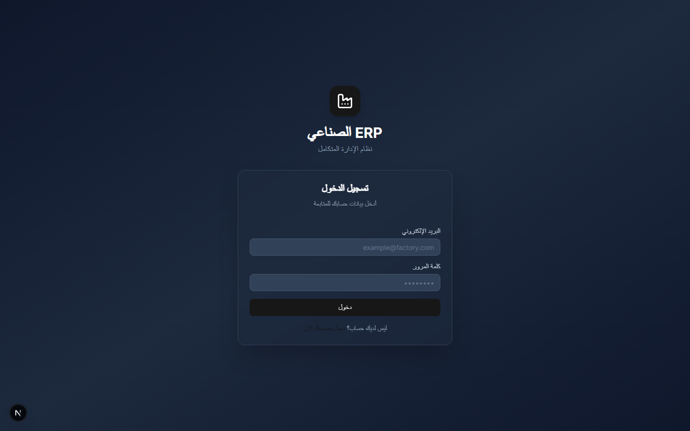
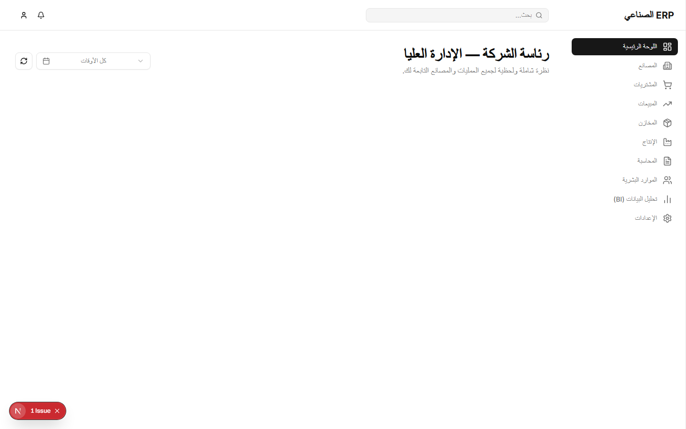
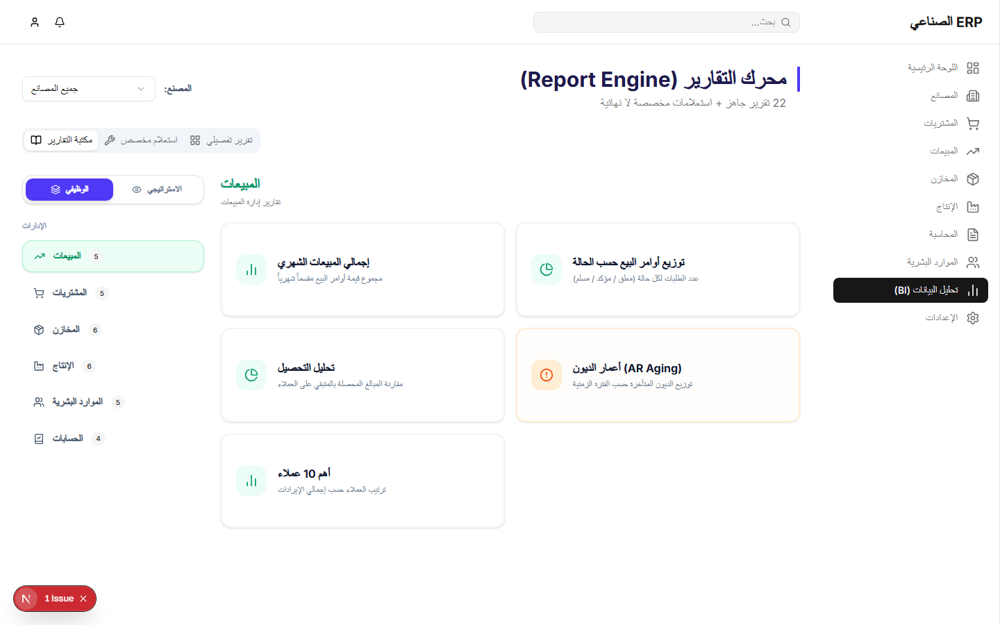
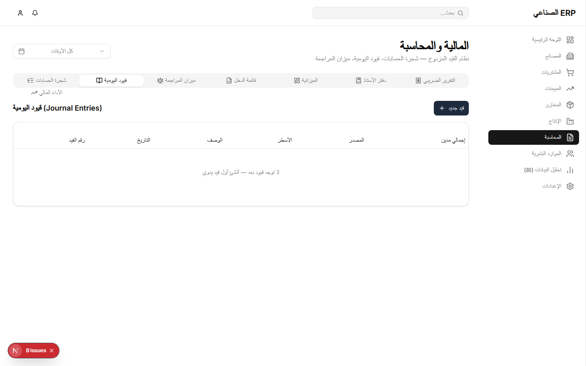
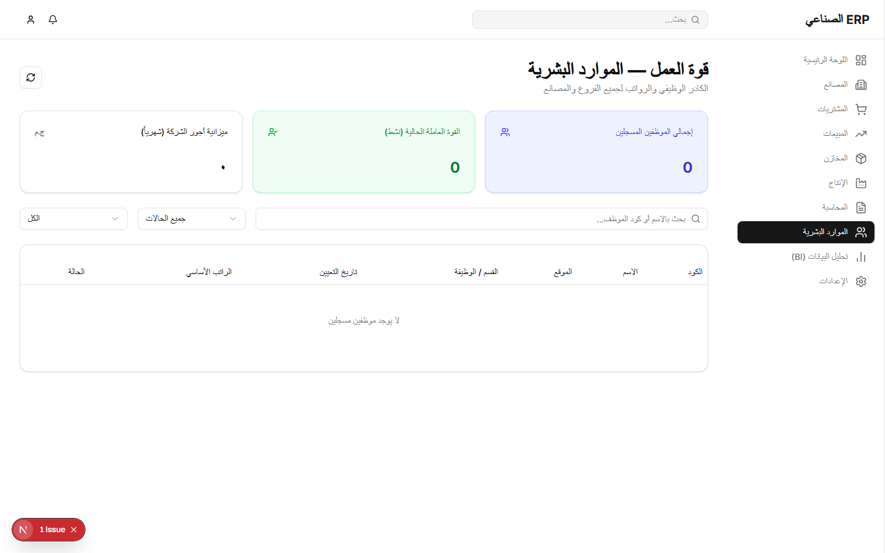
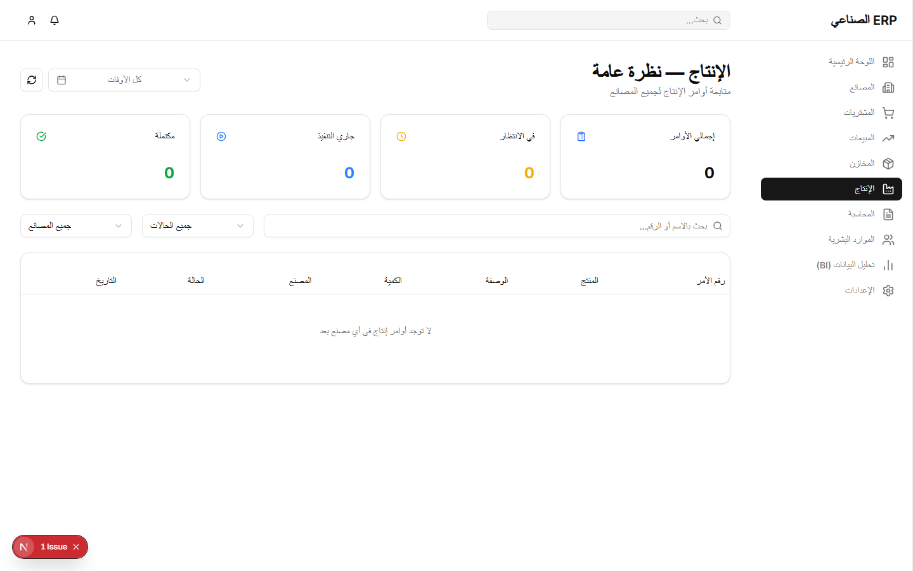
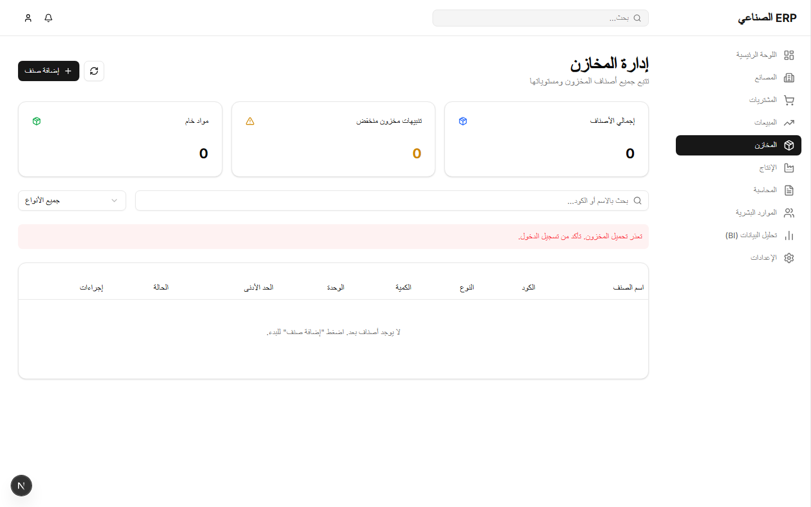
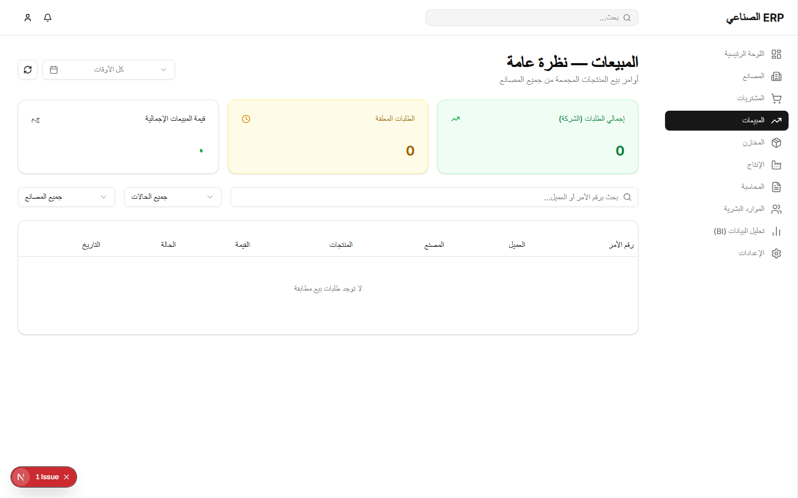
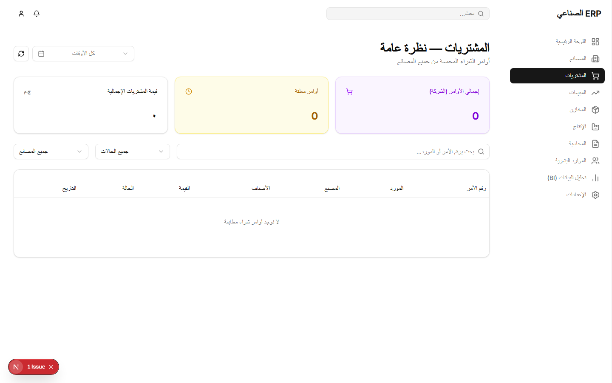

<div align="center">

# 🏭 ERP الصناعي — Industrial ERP System

**نظام تخطيط موارد المشاريع الصناعية متعدد المصانع**  
*Multi-Factory Industrial Enterprise Resource Planning System*

[](https://nextjs.org/)
[](https://reactjs.org/)
[](https://typescriptlang.org/)
[](https://nodejs.org/)
[](https://mongodb.com/)
[](https://github.com/mohamedEltoor/erp-sass)

---

### A full-featured, Arabic-first ERP built to manage multi-factory operations end-to-end — from purchasing and production to payroll and business intelligence.

> 📌 **Source code available upon request** | Built by [Mohamed Eltoor](https://github.com/mohamedEltoor)

</div>

---

## 📸 Screenshots

### 🔐 Login Page


### 🏠 Executive Dashboard


### 📊 BI Report Engine — 22 Pre-built Reports + Custom Queries


### 💰 Accounting — Journal Entries, Chart of Accounts, Financial Reports


### 👥 Human Resources — Employee Registry & Payroll Budget


### 🏭 Production — Manufacturing Orders Tracking


### 📦 Inventory & Warehousing


### 🛒 Sales Orders


### 📋 Purchasing & Procurement


---

## ✨ Key Features

### 🏠 Executive Dashboard
- **Real-time KPI cards** — Net profit, total sales, procurement volume, factory count
- **Live activity feed** — Latest transactions across all factories in one view
- **Quick liquidity overview** — Income vs. expenses with net balance at a glance
- **Date-range filtering** — Filter all KPIs by custom time period

### 📊 Business Intelligence (BI) — Report Engine
- **22 pre-built reports** spanning Sales, Procurement, Inventory, Production, HR, and Accounting
- **2 navigation modes** — Functional (by department) or Strategic (by report family: Status / Transaction / Analytical / Audit)
- **Audit alerts** — AR Aging, overdue production orders, reorder warnings, dormant inventory
- **Custom Ad-hoc Query Builder** — Choose data source, dimension (X-axis), measure (Y-axis), date range, sort & limit
- **Detail Report Builder** — Row-level drill-down with custom column selection and filters
- **Export to PDF, Excel, CSV** — One-click from any chart or table

### 💰 Accounting
- **Double-entry journal** (يومية القيود) — Full debit/credit accounting
- **Chart of accounts** with multi-level hierarchy
- **Cost center** tracking per transaction
- **Opening balances** module for initial setup
- **Income, expense, and net profit** auto-calculation

### 👥 Human Resources (HR)
- Employee registry with ID, department, position, hire date, and status (Active / On Leave / Terminated)
- **Monthly payroll budget** tracking per factory
- **Attendance & absence** management with late-minute tracking
- **Salary advances** and absence deductions
- **Performance evaluations** module
- Search & filter by name, ID, status, or factory

### 🏭 Production
- **Production orders** (أوامر الإنتاج) with planned vs. actual quantity tracking
- **Bill of Materials (BOM)** — recipe/formula management per product
- **Production lines & machines** management
- **Scrap quantity** (هالك) tracking and OEE efficiency scoring
- WIP (Work in Progress) monitoring

### 📦 Inventory & Warehousing
- **Multi-warehouse** stock management
- **Inventory logs** — full movement history (in/out)
- **Low-stock alerts** and reorder level monitoring
- **ABC analysis** — classify items by value contribution
- **Dormant stock** detection (items not moved in 90+ days)
- **Inventory turnover** rate calculation

### 🛒 Purchasing
- **Purchase requests → Purchase orders** workflow
- **Vendor management** with lead time performance tracking
- **Purchase price trend** analysis over time
- **Vendor payments** and AP tracking

### 💼 Sales
- **Quotations → Sales orders** workflow
- **Customer management** with AR tracking
- **Collection status** — paid vs. outstanding per customer
- **AR Aging** — overdue debt breakdown by time period
- **Top 10 customers** by revenue

### 🏭 Multi-Factory Architecture
- Each module is **factory-scoped** — filter any data by factory or view aggregate across all
- Supports **main facility + multiple branches**
- **JWT-based authentication** per tenant
- Role-based access per factory

---

## 🛠️ Tech Stack

| Layer | Technology |
|---|---|
| **Frontend** | Next.js 16, React 19, TypeScript 5 |
| **UI Components** | shadcn/ui, Radix UI, Lucide Icons |
| **Styling** | Tailwind CSS v4 |
| **Charts** | Recharts (Bar, Line, Pie) |
| **Backend** | Node.js, Express 5 |
| **Database** | MongoDB Atlas (Mongoose ODM) |
| **Auth** | JWT (jsonwebtoken) + bcryptjs |
| **Export** | jsPDF, xlsx (SheetJS), html2canvas |
| **State** | TanStack Query (React Query v5) |

---

## 🗂️ Project Structure

```
erp/
├── frontend/               # Next.js 16 App Router
│   └── src/
│       ├── app/
│       │   ├── page.tsx          # Executive Dashboard
│       │   ├── accounting/       # Accounting & Journal
│       │   ├── hr/               # Human Resources
│       │   ├── inventory/        # Warehouse & Stock
│       │   ├── production/       # Manufacturing Orders
│       │   ├── purchasing/       # Purchase Orders
│       │   ├── sales/            # Sales Orders
│       │   ├── bi/               # BI Report Engine
│       │   └── factories/        # Factory Management
│       └── components/
│           ├── Sidebar.tsx
│           ├── Header.tsx
│           └── DateFilter.tsx
│
└── backend/                # Node.js + Express REST API
    ├── models/             # 28 Mongoose models
    ├── controllers/        # Business logic
    ├── routes/             # 12 API route files
    ├── middleware/         # Auth & tenant middleware
    └── server.js
```

---

## 🚀 Getting Started

### Prerequisites
- Node.js 18+
- MongoDB Atlas account (or local MongoDB)

### 1. Clone the repo
```bash
git clone https://github.com/YOUR_USERNAME/erp.git
cd erp
```

### 2. Backend setup
```bash
cd backend
npm install

# Create .env file
cp .env.example .env
# Fill in: MONGO_URI, JWT_SECRET, PORT
```

### 3. Frontend setup
```bash
cd frontend
npm install

# Create .env.local
echo "NEXT_PUBLIC_API_URL=http://localhost:5000/api" > .env.local
```

### 4. Run both servers
```bash
# Terminal 1 — Backend
cd backend && npm run dev

# Terminal 2 — Frontend
cd frontend && npm run dev
```

Open [http://localhost:3000](http://localhost:3000)

---

## 📊 Data Models (28 Models)

`Employee` · `Payroll` · `PayrollDecision` · `Attendance` · `Evaluation` · `Advance`  
`SalesOrder` · `Quotation` · `Customer`  
`PurchaseOrder` · `PurchaseRequest` · `Vendor` · `VendorPayment`  
`ProductionOrder` · `BOM` · `ProductionLine` · `Machine`  
`Inventory` · `InventoryLog` · `Warehouse`  
`JournalEntry` · `Account`  
`Factory` · `Department` · `WorkSchedule`  
`Tenant` · `User` · `Alert`

---

## 📄 License

This project is **source-available** — you may view and learn from the code, but commercial use requires explicit permission from the author.

© 2025 [Mohamed Eltoor](https://github.com/mohamedEltoor) — All Rights Reserved

---

<div align="center">

**Built with ❤️ by [Mohamed Eltoor](https://github.com/mohamedEltoor)**  
*Full-stack Arabic-first ERP from scratch — Next.js 16 · Node.js · MongoDB*

[](https://github.com/mohamedEltoor)

</div>
